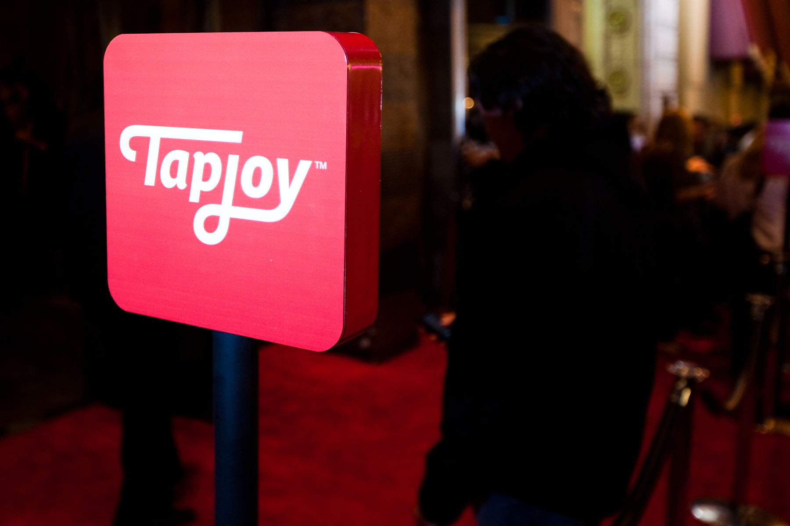

<!SLIDE bullets incremental>
# You have completed RailsBridge #40 (we think)
* Congratulations!

<!SLIDE bullets>
# What worked well for people?
* For volunteers?
* For organizers?
* For students?

<!SLIDE bullets>
# What could we improve?
* For volunteers?
* For organizers?
* For students?

<!SLIDE bullets>

<!SLIDE bullets>
# Resources:
* http://installfest.railsbridge.org/workshop/resources
* http://pinterest.com/pvnrtmol/ruby-and-rails-resources/
* http://pinterest.com/eanakashima/learn-the-front-end/
* Follow-up:
* Ruby Users of Minnesota — a fine group of Ruby enthusiasts from around the Twin Cities metro area, or pretty much wherever they feel like driving from. Our group meets on the last Monday of each month at 7 PM http://ruby.mn/
* RailsBridge IRC channel
* DevChix E-mail list http://www.devchix.com/
* Systers mailing list
* Want to organize a workshop? join railsbridge-workshops@googlegroups.com

<!SLIDE bullets>
# Thanks for Tapjoy and Claire for sponsoring.
* Claire has zero embarrasing photos on Facebook (I looked)

<!SLIDE bullets>
# Super big thanks to

|Jackie | Amir |
|----|-----|
|  | 

For the last 8 weeks of planning

<!SLIDE bullets>
# Also thanks to
* Stephanie and Bob and Lillie if you're here

<!SLIDE bullets>
# Celebrate!
* After-party at Murphy's pub
* Google says its, like, 492 ft away.
* Google also says it's 2 mins by foot.
* Google also says it's 43 seconds by car.
* And if you ask Google how long the bus will take....it tells you to walk (for real)
