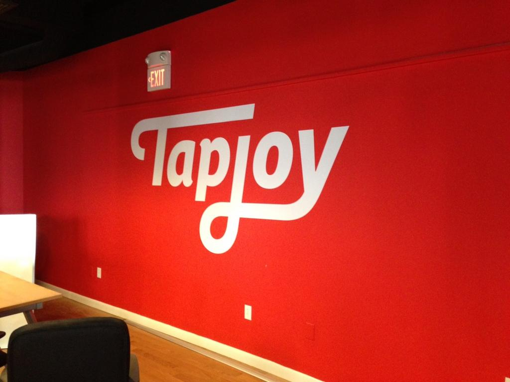
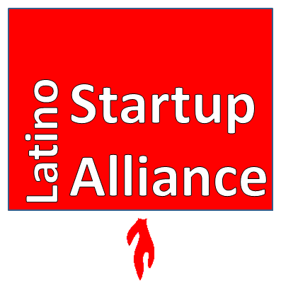
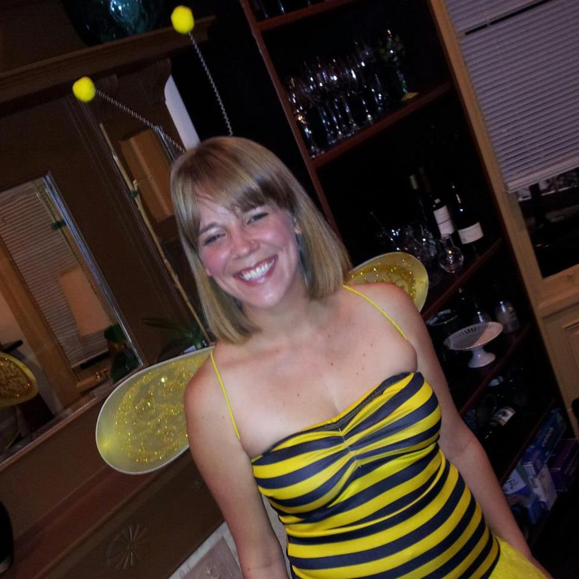
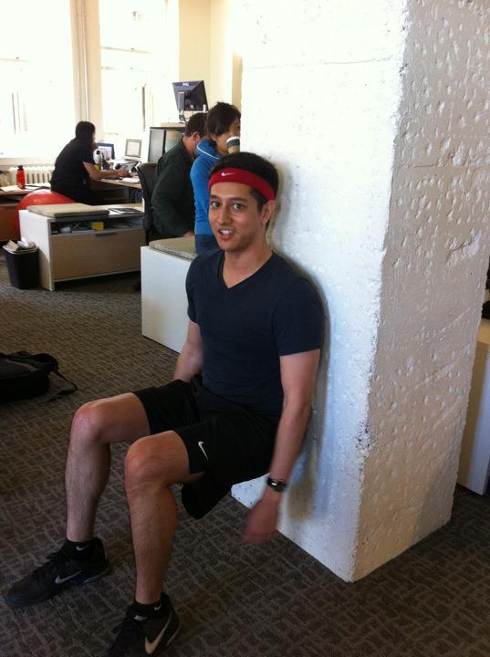
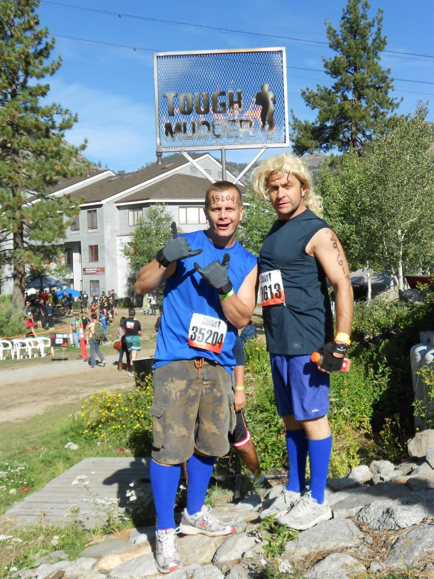

<!SLIDE bullets incremental>
# Welcome to RailsBridge
* This is the 40th workshop (or something)
* OMG

<!SLIDE bullets>
# Thank you to our lovely sponsors

* Tapjoy is awesome (yes, I get paid to say that)

<!SLIDE bullets>
# Thank you to our partners

<!SLIDE bullets>
# And thank you to Nick and Flannery!

<!SLIDE bullets>
# Schedule
* 9:00-9:30 Teachers and Students arrive
* 9:30-10:00 Workshop Intro
* 10:00-12:30 Morning Session
* 12:30-1:30 Lunch
* 1:30-2:50 Session 3
* 2:50-3:00 Break
* 3:00-4:20 Session 4
* 4:30-4:50 Student and Volunteer Retrospective (Put the Keg to use)
* 4:50-5:10 Help us clean up or Stephanie and Bob will kill me
* 5:15 Grab a drink (or 2 or 3?) at Murphys

<!SLIDE bullets>
# If you need help find Jackie

<!SLIDE bullets>
# Or Amir

<!SLIDE bullets>
# And just to be fair

