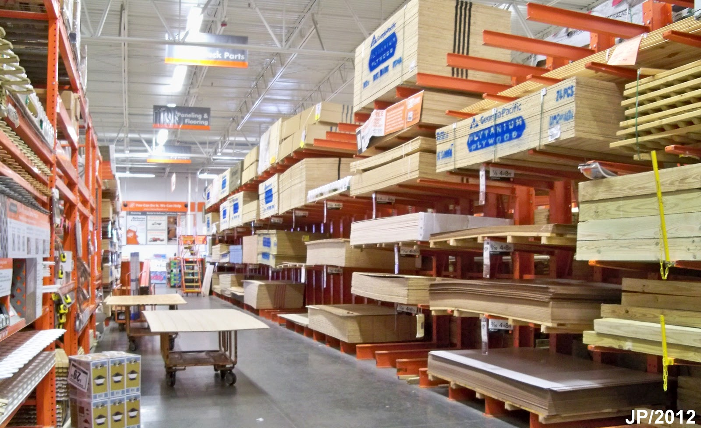

!SLIDE centereverything bullets

# Ruby on Rails Workshop

<!SLIDE bullets>

# Open source workshop

* It's a community project!
  * Many individuals
  * RailsBridge

* All materials are open!
  * RailsBridge wiki
  * Slides: github, deck
  * See <http://github.com/railsbridge>

<!SLIDE bullets>
# Why are we here?
We want the community of software developers to reflect the diversity of our society

<!SLIDE bullets>
# Why are we here?
* Ruby on Rails!

<!SLIDE bullets>
# What is Ruby on Rails?

!SLIDE center
# Ruby vs. Rails

|Ruby is a Language | Rails is a Framework |
|----|-----|
|  |  |

<!SLIDE bullets>
# Say you want to build a house

<!SLIDE bullets>
# Ruby: programming language
* Ruby is a collection of power tools & raw materials

<!SLIDE bullets>
# Rails: web application framework

* Rails is a bunch of prebuilt stuff every house needs

<!SLIDE bullets>
# Rails: web application framework
* Programers call these libraries
* Ruby programmers call these gems

<!SLIDE bullets>
# Goal:
### &nbsp;
### By the end of the day, you will have built and deployed a web application - live on the internet!

<!SLIDE bullets>
# Actually, not really
### &nbsp;
### The real goal is to expand your knowledge horizons, keep thing interesting and motivate you to keep learning ruby and rails.

### &nbsp;
*Some classes won't finish the curriculum

<!SLIDE bullets>
# Don't be shy!
* Ask questions!
* Ask a lot of questions
* TAs and teachers are here to help

<!SLIDE bullets>
# The real real goals
* Learning the tenacity to stick with it and to dive back in
* Being comfortable not knowing  (I'm still not)

<!SLIDE bullets>
# Programming is often:
* Confusing
* Slow (when you can't get something to work)
* Scary (when you think eveyone else knows what going on)

* It takes months for jr developers to get up to speed at a new firm

<!SLIDE bullets>
# Programming has thousands of new terms and jargon
* **rake**: A tool for running tasks.
* **git**: source code control.
* **database**: we'll use SQLite, but could be any relational database.
* **editor**: Sublime Text 2.
* **heroku**: free Rails hosting.
* **Dry**: Don't Repeat Yourself.
* **TDD**: Test Driven Development.
* **Convention over configuration**.
* **Pair Programming**.
* **DHH**: David Heinemeier Hansson.
* **Matz**: Yukihiro "Matz" Matsumoto.
* **Way, way more**.

* Your teachers will use these and others without even knowing it. Interupt them.

<!SLIDE bullets>
# Why the Ruby community is awesome
* 90 Meetups within 50 miles of SF tagged with 'Ruby'

* Number of upcomming Ruby meetups:
<http://www.meetup.com/find/?offset=0&psize=64&currentpage=1&allMeetups=true&categories=&keywords=ruby&radius=50&userFreeform=San+Francisco%2C+CA%2C+USA&mcId=z94101&mcName=San+Francisco%2C+CA&events=true&sort=default&year=2013&month=4&day=7>

<!SLIDE bullets>
# Materials
* Slides: <http://curriculum.railsbridge.org/workshop>
* Suggestotron Curriculum: <http://curriculum.railsbridge.org/>

<!SLIDE bullets>
# What will you learn today?
* Ruby
  * understanding the Ruby programming language
* Rails
  * learn tools and patterns for building web apps in Ruby on Rails

---
Proceed to next slide deck: [Today's Workshop Info and Schedule](current)
